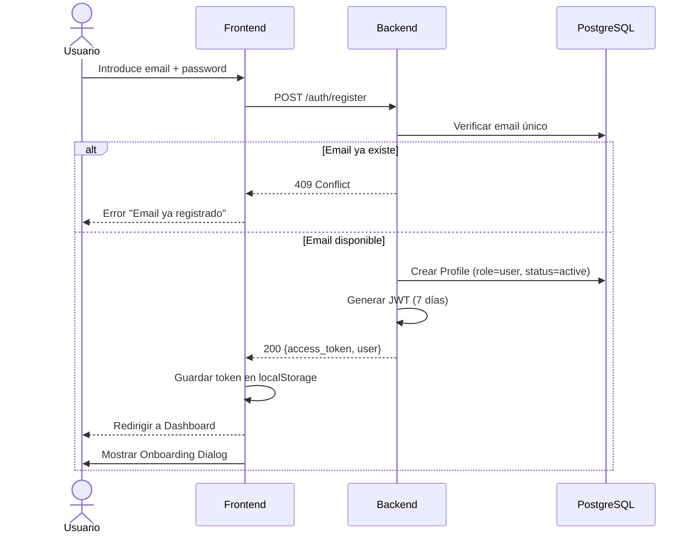
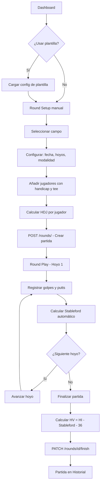
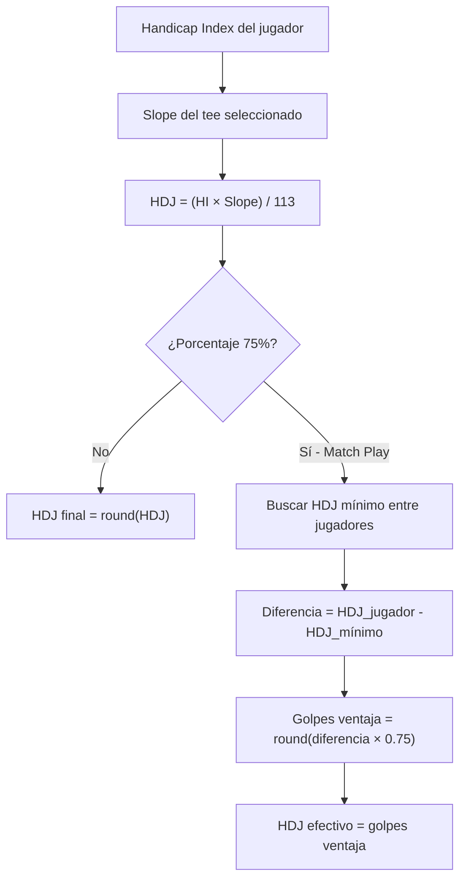
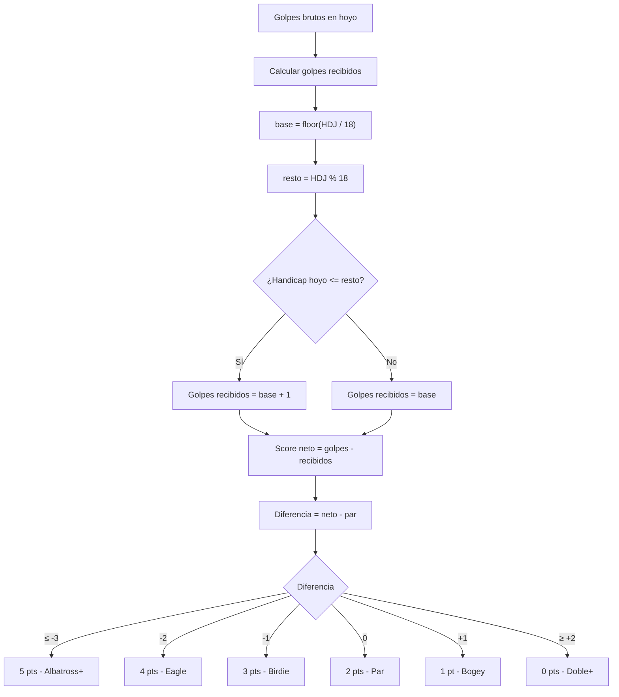
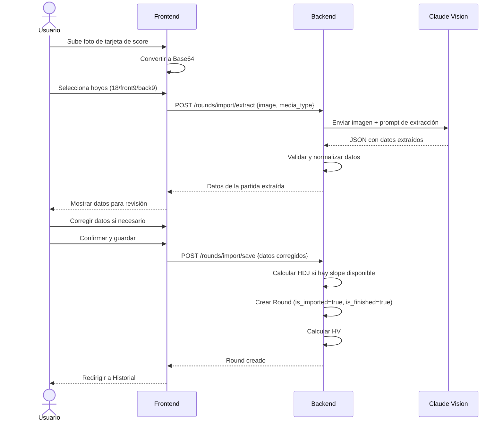
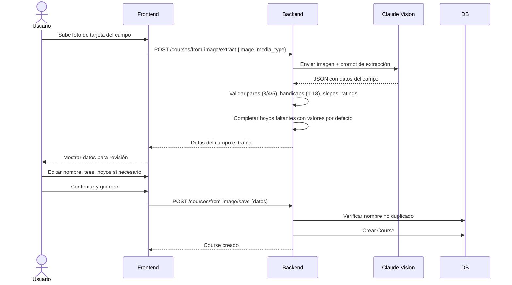
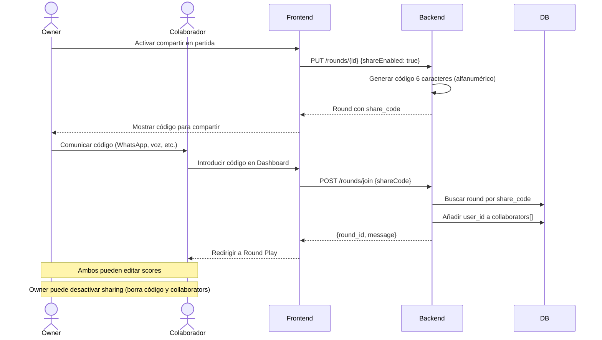
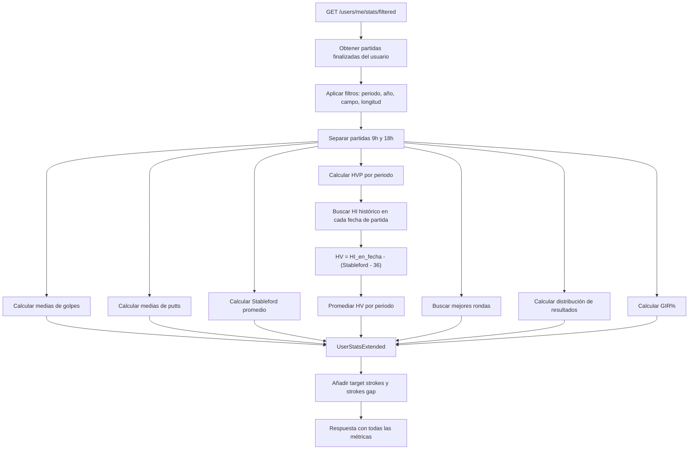
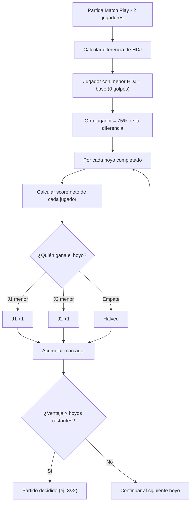
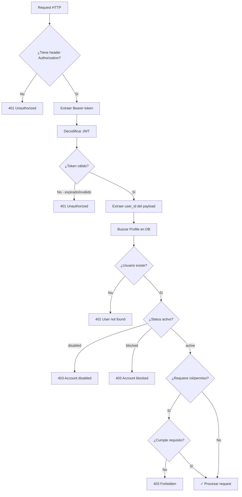

# GolfShot — Flujos de Negocio

## 1. Registro y Autenticación

## 2. Crear y Jugar una Partida

## 3. Cálculo del Handicap de Juego (HDJ)

## 4. Cálculo de Puntos Stableford

## 5. Importación OCR de Partida

## 6. Importación OCR de Campo

## 7. Compartir Partida

## 8. Cálculo de Estadísticas

## 9. Match Play

## 10. Flujo de Autenticación JWT

